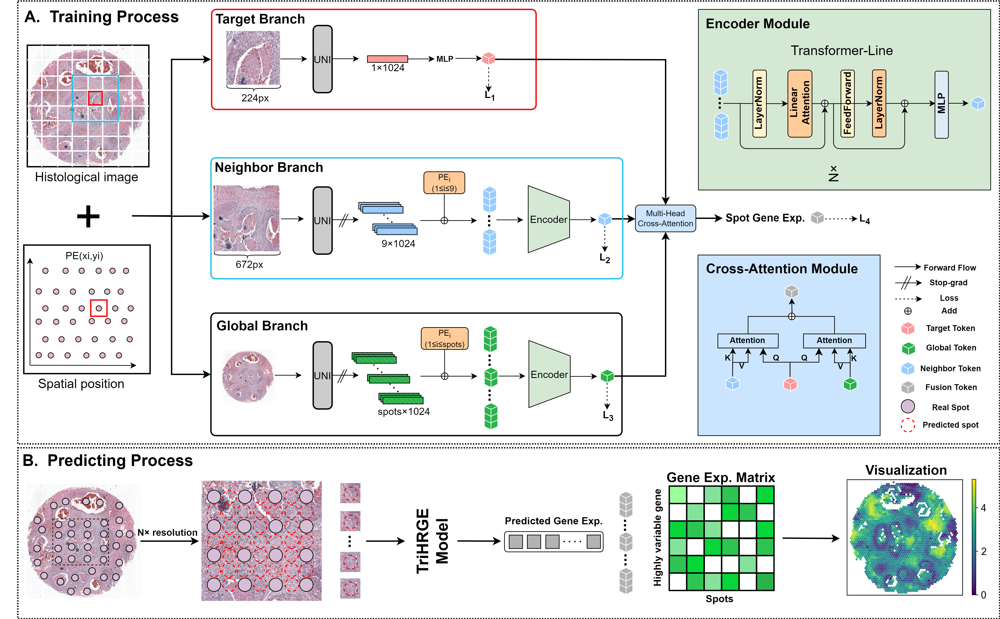

# TriHRGE
## Introduction
Single-cell RNA sequencing (scRNA-seq) has transformed our understanding of individual cells within a population, but it lacks spatial information, limiting its ability to decipher cell interactions and spatial correlations in tissue structures. Spatial transcriptomics (ST) overcomes this by preserving the spatial localization of cells, offering detailed gene expression patterns, and demonstrating great potential in immunology, developmental biology, and oncology. However, ST technologies still struggle to balance spatial resolution and sequencing depth. Image-based methods offer single-cell spatial resolution but limited sequencing depth, while NGS-based methods can profile the entire transcriptome but have low spatial resolution. Existing deep learning-based methods also face challenges in achieving both high spatial resolution and sequencing depth. To address this, we developed TriHRGE, a multimodal deep learning framework that enhances spatial gene expression by integrating multi-scale feature fusion and linear feature extraction using histological images and low-resolution ST data. TriHRGE captures both macroscopic tissue structure and microscopic cellular patterns, outperforming existing methods in gene expression prediction and generating high-resolution gene expression maps.



## Requirements
All experiments were conducted on an NVIDIA RTX 3090 GPU. Before running HISTEX, you need to create a conda environment and install the required packages:
```shell
conda create -n HISTEX python==3.11.5
conda activate HISTEX
pip install -r requirements.txt
```

## Data
The Xenium human breast cancer datasets: [https://www.10xgenomics.com/products/xenium-in-situ/preview-dataset-human-breast](https://www.10xgenomics.com/products/xenium-in-situ/preview-dataset-human-breast).

The Visium HD human breast cancer: [https://www.10xgenomics.com/datasets/visium-hd-cytassist-gene-expression-human-breast-cancer-fresh-frozen](https://www.10xgenomics.com/datasets/visium-hd-cytassist-gene-expression-human-breast-cancer-fresh-frozen).

The Visium HD mouse brain: [https://www.10xgenomics.com/datasets/visium-hd-cytassist-gene-expression-mouse-brain-fresh-frozen](https://www.10xgenomics.com/datasets/visium-hd-cytassist-gene-expression-mouse-brain-fresh-frozen).

The HER2-positive breast cancer datasets: [https://github.com/almaan/her2st](https://github.com/almaan/her2st).

## Pre-trained general-purpose foundation mode
Given the outstanding performance of large pre-trained general-purpose foundation models in clinical tasks, we use UNI as the backbone feature extractor. Before using HISTEX, you need to apply to UNI for permission to access the model weights: [https://huggingface.co/mahmoodlab/UNI](https://huggingface.co/mahmoodlab/UNI).

## Training and Inferring
- First, histology image and location information are normalized by running [`image_calibration.py`](image_calibration.py).
- Second, high-density spot-based ST data and histological features are acquired by running [`get_HR.py`](get_HR.py) and [`Histology_Extractor.py`](Histology_Extractor.py).
- Third, mask file is obtained to filter out non-tissue areas by running [`masking_non_tissue.py`](masking_non_tissue.py).
- Finally, super-resolution gene expression profiles are generated by running [`HISTEX.py`](HISTEX.py).
```shell
python image_calibration.py --directory dataset\\
python get_HR.py --directory dataset\\
python Histology_Extractor.py --directory dataset\\ --login ***
python masking_non_tissue.py --directory dataset\\
python HISTEX.py --directory dataset\\ --epochs 500 --n-states 5
```
`--directory` represents the directory of your dataset, and `--login` represents the key of the UNI model you own.

## Contact details
If you have any questions, please contact email@anonymized.com (The current paper is undergoing double-blind review at MICCAI 2025).
